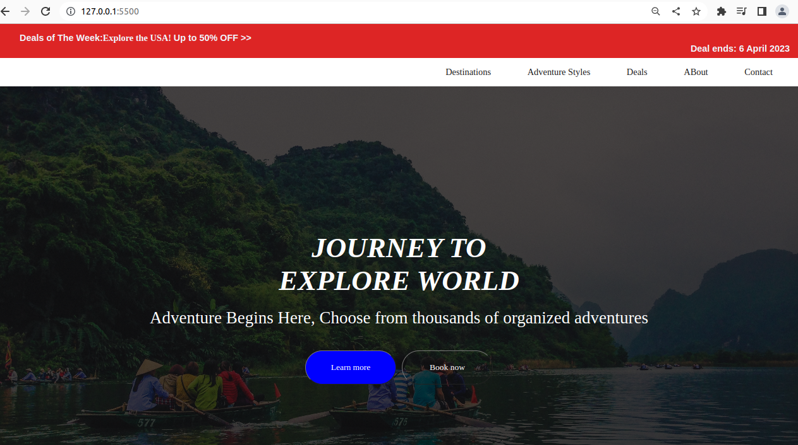
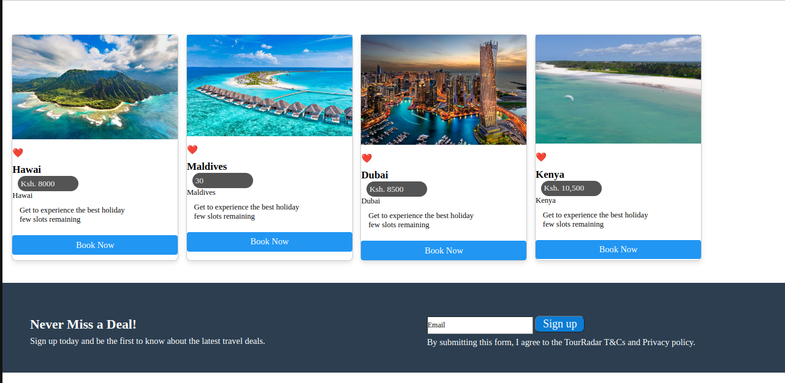
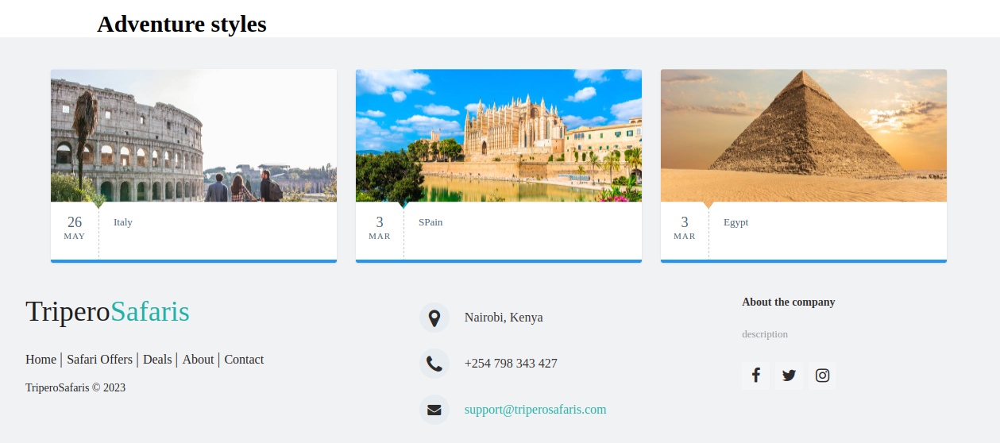

# Tours-Travel
  
  

  <h2>Tripero- Travel website</h2>

Tripero is tour & travel mini web app , <br /> built using HTML, CSS, and JavaScript.

  <a href="https://sirkaranja.github.io/Tours-Travel/"><strong>➥ Live Demo</strong></a>

</div>

<br />

### Demo Screeshots







### Prerequisites

Before you begin, ensure you have met the following requirements:

* [Git](https://git-scm.com/downloads "Download Git") must be installed on your operating system.
*Json server must be installed

### Run Locally

To run **Tripero** locally, run this command on your git bash:

Linux and macOS:

```bash
sudo git clone git@github.com:sirkaranja/Tours-Travel.git
```

Windows:

```bash
git clone git@github.com:sirkaranja/Tours-Travel.git

```
### installation
Clone the repository to your local machine. <br>
Install json server run json-server --watch db.json<br> 
Copy code Start the server by running live server server.<br>
 Navigate to http://localhost:3000 in your browser to use the application.<br>

### Contact

You can reach me at [sirkaranja12@gmail.com].

### License

 MIT License

Copyright (c) 2023
 Daniel Karanja
